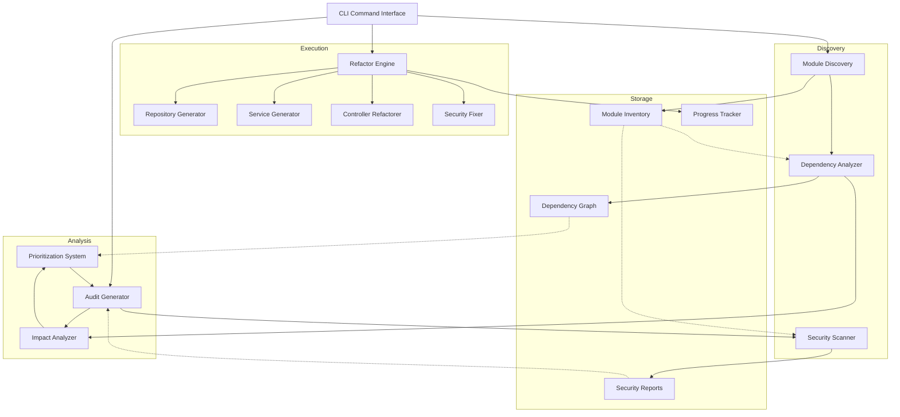

# Design Document: Security Architecture Refactor

## Overview

This design document outlines the architecture for a systematic refactoring system that transforms a CodeIgniter 4 application from fat controllers with mixed concerns into a clean, secure architecture following the Thin Controller → Service → Repository pattern. The system provides automated analysis, prioritization, and execution capabilities to safely refactor modules while simultaneously identifying and fixing security vulnerabilities.

### Goals

1. **Automated Discovery**: Scan and catalog all modules (controllers, models, views) in the CodeIgniter 4 application
2. **Dependency Analysis**: Build a dependency graph to understand module relationships and calculate impact scores
3. **Security Scanning**: Identify common vulnerabilities (SQL injection, XSS, CSRF, insecure auth) in existing code
4. **Safe Refactoring**: Provide audit-first workflow with rollback capabilities and incremental execution
5. **Architecture Transformation**: Systematically apply Thin Controller → Service → Repository pattern
6. **Web/API Separation**: Split mixed controllers into dedicated Web and API controllers with appropriate response formats
7. **Progress Tracking**: Monitor refactoring progress across all modules with status tracking

### Non-Goals

- Automated testing generation (tests must be written manually)
- Performance optimization beyond architectural improvements
- Database schema refactoring or migration
- Frontend JavaScript refactoring
- Automated deployment or CI/CD integration

## Architecture

### System Components



### Architectural Layers

#### 1. Discovery Layer
Responsible for scanning the codebase and building an understanding of the current state.

- **Module Discovery**: Scans `app/Controllers` and `app/Models` directories to identify all modules
- **Dependency Analyzer**: Parses PHP code using AST (Abstract Syntax Tree) to identify dependencies
- **Security Scanner**: Uses pattern matching and static analysis to detect vulnerabilities

#### 2. Analysis Layer
Processes discovered information to provide actionable insights.

- **Impact Analyzer**: Calculates how many modules would be affected by refactoring a specific module
- **Prioritization System**: Ranks modules by impact score and dependency depth
- **Audit Generator**: Creates detailed reports without modifying code

#### 3. Execution Layer
Performs the actual refactoring operations.

- **Refactor Engine**: Orchestrates the refactoring process with backup and rollback capabilities
- **Repository Generator**: Creates repository classes with Query Builder patterns
- **Service Generator**: Extracts business logic into service classes
- **Controller Refactorer**: Transforms fat controllers into thin controllers
- **Security Fixer**: Implements security fixes identified during scanning

#### 4. Storage Layer
Persists analysis results and tracks progress.

- **Module Inventory**: JSON file containing all discovered modules and metadata
- **Dependency Graph**: JSON representation of module dependencies
- **Security Reports**: JSON files with vulnerability findings per module
- **Progress Tracker**: JSON file tracking refactoring status for each module

## Components and Interfaces

### 1. Module Discovery Component

**Purpose**: Scan the CodeIgniter 4 application to identify all modules and their components.

**Input**:
- Application root path
- Directories to scan (default: `app/Controllers`, `app/Models`)

**Output**:
- Module inventory JSON file

**Key Classes**:

```php
class ModuleDiscovery
{
    public function __construct(
        private string $appPath,
        private FileScanner $fileScanner,
        private CodeParser $codeParser
    ) {}
    
    public function discover(): ModuleInventory;
    private function scanControllers(): array;
    private function scanModels(): array;
    private function scanServices(): array;
    private function scanRepositories(): array;
    private function identifyRelationships(): array;
}

class ModuleInventory
{
    public array $modules;
    public array $controllers;
    public array $models;
    public array $services;
    public array $repositories;
    public DateTime $discoveredAt;
    
    public function toJson(): string;
    public static function fromJson(string $json): self;
    public function getModule(string $name): ?Module;
}

class Module
{
    public string $name;
    public string $controllerPath;
    public array $modelPaths;
    public ?string $servicePath;
    public ?string $repositoryPath;
    public array $routes;
    public array $methods;
}
```

### 2. Dependency Analyzer Component

**Purpose**: Build a dependency graph showing how modules depend on each other.

**Input**:
- Module inventory
- Source code files

**Output**:
- Dependency graph JSON file
- Impact scores for each module

**Key Classes**:

```php
class DependencyAnalyzer
{
    public function __construct(
        private ModuleInventory $inventory,
        private ASTParser $astParser
    ) {}
    
    public function analyze(): DependencyGraph;
    private function parseControllerDependencies(string $filePath): array;
    private function parseModelDependencies(string $filePath): array;
    private function detectCircularDependencies(): array;
    private function calculateImpactScores(): array;
}

class DependencyGraph
{
    public array $nodes;        // Module names
    public array $edges;        // [from => to] relationships
    public array $impactScores; // [module => score]
    public array $circular;     // Circular dependency chains
    
    public function getDependents(string $module): array;
    public function getDependencies(string $module): array;
    public function getImpactScore(string $module): int;
    public function toMermaid(): string;
}
```

### 3. Security Scanner Component

**Purpose**: Identify security vulnerabilities in module code.

**Input**:
- Module file paths
- Security rule definitions

**Output**:
- Security report JSON per module

**Key Classes**:

```php
class SecurityScanner
{
    public function __construct(
        private array $rules,
        private ASTParser $astParser
    ) {}
    
    public function scanModule(Module $module): SecurityReport;
    private function detectSQLInjection(string $code): array;
    private function detectXSS(string $code): array;
    private function detectCSRFMissing(string $code): array;
    private function detectInsecureAuth(string $code): array;
    private function detectHardcodedCredentials(string $code): array;
    private function detectMissingValidation(string $code): array;
    private function detectInsecureFileUpload(string $code): array;
}

class SecurityReport
{
    public string $moduleName;
    public array $vulnerabilities; // Array of Vulnerability objects
    public DateTime $scannedAt;
    
    public function getBySeverity(string $severity): array;
    public function getCriticalCount(): int;
    public function toJson(): string;
}

class Vulnerability
{
    public string $type;        // SQL_INJECTION, XSS, CSRF, etc.
    public string $severity;    // CRITICAL, HIGH, MEDIUM, LOW
    public string $filePath;
    public int $lineNumber;
    public string $description;
    public string $recommendation;
    public ?string $codeSnippet;
}
```

### 4. Prioritization System Component

**Purpose**: Rank modules for refactoring based on impact and dependencies.

**Input**:
- Dependency graph
- Security reports
- Manual priority overrides (optional)

**Output**:
- Ordered list of modules to refactor

**Key Classes**:

```php
class PrioritizationSystem
{
    public function __construct(
        private DependencyGraph $graph,
        private array $securityReports
    ) {}
    
    public function prioritize(): array;
    private function identifyLeafModules(): array;
    private function identifyCoreModules(): array;
    private function calculatePriorityScore(string $module): float;
    public function applyManualOverride(string $module, int $priority): void;
}

class PriorityScore
{
    public string $module;
    public float $score;
    public int $impactScore;
    public int $dependencyDepth;
    public int $criticalVulnerabilities;
    public string $category; // LEAF, CORE, INTERMEDIATE
    public ?int $manualPriority;
}
```

### 5. Audit Generator Component

**Purpose**: Generate detailed audit reports for modules without modifying code.

**Input**:
- Module to audit
- Security report
- Dependency information

**Output**:
- Audit report markdown file

**Key Classes**:

```php
class AuditGenerator
{
    public function __construct(
        private ModuleInventory $inventory,
        private SecurityScanner $scanner,
        private ImpactAnalyzer $impactAnalyzer,
        private CodeAnalyzer $codeAnalyzer
    ) {}
    
    public function generateAudit(string $moduleName): AuditReport;
    private function analyzeControllerStructure(string $filePath): ControllerAnalysis;
    private function identifyBusinessLogic(string $code): array;
    private function identifyDatabaseQueries(string $code): array;
    private function estimateComplexity(): string; // SIMPLE, MEDIUM, COMPLEX
}

class AuditReport
{
    public string $moduleName;
    public ControllerAnalysis $controllerAnalysis;
    public array $businessLogicToExtract;
    public array $queriesToMove;
    public SecurityReport $securityReport;
    public ImpactAnalysis $impactAnalysis;
    public string $complexity;
    public array $recommendations;
    public DateTime $generatedAt;
    
    public function toMarkdown(): string;
}

class ControllerAnalysis
{
    public int $methodCount;
    public int $linesOfCode;
    public array $methods;
    public bool $hasValidation;
    public bool $hasBusinessLogic;
    public bool $hasDirectQueries;
    public array $dependencies;
}
```

### 6. Refactor Engine Component

**Purpose**: Orchestrate the refactoring process with safety mechanisms.

**Input**:
- Module to refactor
- Approved audit report
- Refactoring options

**Output**:
- Refactored code files
- Refactoring summary report

**Key Classes**:

```php
class RefactorEngine
{
    public function __construct(
        private RepositoryGenerator $repoGen,
        private ServiceGenerator $svcGen,
        private ControllerRefactorer $ctrlRef,
        private SecurityFixer $secFix,
        private BackupManager $backup,
        private ProgressTracker $progress
    ) {}
    
    public function refactor(string $moduleName, RefactorOptions $options): RefactorResult;
    private function createBackup(array $files): string;
    private function executeStep(RefactorStep $step): StepResult;
    private function rollback(string $backupId): void;
    private function runTests(): TestResult;
}

class RefactorOptions
{
    public bool $createRepository = true;
    public bool $createService = true;
    public bool $refactorController = true;
    public bool $fixSecurity = true;
    public bool $separateWebApi = true;
    public bool $runTests = false;
    public bool $createGitCommits = true;
}

class RefactorResult
{
    public bool $success;
    public array $filesCreated;
    public array $filesModified;
    public array $stepsCompleted;
    public ?string $backupId;
    public ?string $errorMessage;
    public DateTime $completedAt;
    
    public function toMarkdown(): string;
}
```

### 7. Repository Generator Component

**Purpose**: Create repository classes with Query Builder patterns.

**Input**:
- Model file path
- Queries to extract from controller/model

**Output**:
- Repository class file

**Key Classes**:

```php
class RepositoryGenerator
{
    public function __construct(
        private CodeGenerator $codeGen,
        private QueryAnalyzer $queryAnalyzer
    ) {}
    
    public function generate(string $modelName, array $queries): string;
    private function generateCrudMethods(string $modelName): array;
    private function convertToQueryBuilder(string $rawQuery): string;
    private function generateComplexQueryMethod(Query $query): string;
    private function addParameterBinding(string $query): string;
}
```

### 8. Service Generator Component

**Purpose**: Extract business logic into service classes.

**Input**:
- Controller file path
- Business logic to extract

**Output**:
- Service class file

**Key Classes**:

```php
class ServiceGenerator
{
    public function __construct(
        private CodeGenerator $codeGen,
        private ValidationExtractor $validationExtractor
    ) {}
    
    public function generate(string $controllerName, array $businessLogic): string;
    private function extractValidationRules(string $code): array;
    private function generateServiceMethod(BusinessLogic $logic): string;
    private function addTransactionManagement(string $method): string;
    private function generateResultObject(): string;
}
```

### 9. Controller Refactorer Component

**Purpose**: Transform fat controllers into thin controllers.

**Input**:
- Controller file path
- Generated service class name

**Output**:
- Refactored controller file(s)

**Key Classes**:

```php
class ControllerRefactorer
{
    public function __construct(
        private CodeGenerator $codeGen,
        private ControllerSplitter $splitter
    ) {}
    
    public function refactor(string $controllerPath, string $serviceName): array;
    private function injectService(string $code, string $serviceName): string;
    private function replaceBusinessLogicWithServiceCalls(string $code): string;
    private function addErrorHandling(string $code): string;
    private function splitWebAndApi(string $code): array; // Returns [web, api]
}

class ControllerSplitter
{
    public function split(string $controllerCode): SplitResult;
    private function identifyWebMethods(array $methods): array;
    private function identifyApiMethods(array $methods): array;
    private function generateWebController(array $methods): string;
    private function generateApiController(array $methods): string;
}
```

### 10. Security Fixer Component

**Purpose**: Implement security fixes for identified vulnerabilities.

**Input**:
- Security report
- File paths to fix

**Output**:
- Fixed code files

**Key Classes**:

```php
class SecurityFixer
{
    public function __construct(
        private CodeGenerator $codeGen
    ) {}
    
    public function fix(SecurityReport $report): array;
    private function addCSRFProtection(string $code): string;
    private function addInputValidation(string $code, array $rules): string;
    private function addOutputEscaping(string $viewCode): string;
    private function replaceRawQueryWithQueryBuilder(string $code): string;
    private function addAuthenticationCheck(string $code): string;
    private function addAuthorizationCheck(string $code): string;
    private function addFileUploadValidation(string $code): string;
}
```

## Data Models

### Module Inventory JSON Structure

```json
{
  "discoveredAt": "2024-01-15T10:30:00Z",
  "modules": [
    {
      "name": "Transaksi",
      "controllerPath": "app/Controllers/Transaksi.php",
      "modelPaths": [
        "app/Models/TransaksiModel.php",
        "app/Models/KeuanganModel.php"
      ],
      "servicePath": null,
      "repositoryPath": null,
      "routes": [
        "POST /transaksi/simpan",
        "GET /transaksi/list"
      ],
      "methods": [
        "index",
        "simpan",
        "update",
        "delete"
      ]
    }
  ],
  "controllers": [...],
  "models": [...],
  "services": [...],
  "repositories": [...]
}
```

### Dependency Graph JSON Structure

```json
{
  "nodes": ["Transaksi", "Keuangan", "Kavling", "Konsumen"],
  "edges": [
    {"from": "Transaksi", "to": "Keuangan"},
    {"from": "Transaksi", "to": "Kavling"},
    {"from": "Keuangan", "to": "Konsumen"}
  ],
  "impactScores": {
    "Transaksi": 0,
    "Keuangan": 1,
    "Kavling": 1,
    "Konsumen": 1
  },
  "circular": []
}
```

### Security Report JSON Structure

```json
{
  "moduleName": "Transaksi",
  "scannedAt": "2024-01-15T10:35:00Z",
  "vulnerabilities": [
    {
      "type": "SQL_INJECTION",
      "severity": "CRITICAL",
      "filePath": "app/Controllers/Transaksi.php",
      "lineNumber": 45,
      "description": "Raw SQL query with user input concatenation",
      "recommendation": "Use Query Builder with parameter binding",
      "codeSnippet": "$query = \"SELECT * FROM transaksi WHERE id = \" . $id;"
    },
    {
      "type": "CSRF_MISSING",
      "severity": "HIGH",
      "filePath": "app/Controllers/Transaksi.php",
      "lineNumber": 78,
      "description": "Form submission without CSRF protection",
      "recommendation": "Add CSRF filter to route or use form_open() helper",
      "codeSnippet": null
    }
  ]
}
```

### Progress Tracker JSON Structure

```json
{
  "modules": {
    "Transaksi": {
      "status": "COMPLETED",
      "auditedAt": "2024-01-15T10:40:00Z",
      "refactoredAt": "2024-01-15T11:20:00Z",
      "vulnerabilitiesFixed": 3,
      "backupId": "backup_20240115_112000"
    },
    "Keuangan": {
      "status": "AUDITED",
      "auditedAt": "2024-01-15T12:00:00Z",
      "refactoredAt": null,
      "vulnerabilitiesFixed": 0,
      "backupId": null
    },
    "Kavling": {
      "status": "NOT_STARTED",
      "auditedAt": null,
      "refactoredAt": null,
      "vulnerabilitiesFixed": 0,
      "backupId": null
    }
  },
  "overallProgress": 33.33,
  "totalModules": 3,
  "completedModules": 1
}
```


## Error Handling

### Error Categories

#### 1. Discovery Errors
- **File System Errors**: Directory not found, permission denied
- **Parse Errors**: Invalid PHP syntax, unable to parse AST
- **Configuration Errors**: Missing required configuration, invalid paths

**Handling Strategy**:
- Log detailed error with file path and line number
- Continue scanning other files (fail gracefully)
- Report all errors in summary at end of discovery

#### 2. Analysis Errors
- **Circular Dependency Errors**: Detected circular dependencies between modules
- **Missing Dependency Errors**: Referenced module not found in inventory
- **Invalid Graph Errors**: Malformed dependency graph structure

**Handling Strategy**:
- Report circular dependencies as warnings (not fatal)
- Log missing dependencies but continue analysis
- Validate graph structure before saving

#### 3. Security Scanning Errors
- **Pattern Match Errors**: Regex compilation failures
- **False Positive Handling**: User-reported false positives
- **Rule Loading Errors**: Security rule file not found or invalid

**Handling Strategy**:
- Skip failed rules and log error
- Provide mechanism to mark false positives
- Validate rule syntax on load

#### 4. Refactoring Errors
- **Backup Errors**: Unable to create backup, insufficient disk space
- **Code Generation Errors**: Template rendering failures, invalid syntax
- **File Write Errors**: Permission denied, file locked by another process
- **Test Failures**: Existing tests fail after refactoring

**Handling Strategy**:
- **CRITICAL**: Abort refactoring if backup fails
- Rollback to backup if any step fails
- Provide detailed error message with recovery instructions
- If tests fail, keep backup and prompt user for manual review

#### 5. Validation Errors
- **Invalid Module Name**: Module not found in inventory
- **Invalid Options**: Conflicting refactoring options
- **Prerequisite Errors**: Attempting to refactor before audit

**Handling Strategy**:
- Return validation error immediately (fail fast)
- Provide clear error message with valid options
- Suggest correct command or workflow step

### Error Response Format

All errors follow a consistent structure:

```php
class RefactorError
{
    public string $code;        // ERROR_CODE constant
    public string $message;     // Human-readable message
    public string $category;    // DISCOVERY, ANALYSIS, SECURITY, REFACTOR, VALIDATION
    public string $severity;    // CRITICAL, ERROR, WARNING, INFO
    public ?string $filePath;   // Related file if applicable
    public ?int $lineNumber;    // Related line if applicable
    public ?array $context;     // Additional context data
    public DateTime $occurredAt;
}
```

### Error Codes

```php
// Discovery Errors (1xxx)
const ERROR_FILE_NOT_FOUND = 1001;
const ERROR_PERMISSION_DENIED = 1002;
const ERROR_PARSE_FAILED = 1003;

// Analysis Errors (2xxx)
const ERROR_CIRCULAR_DEPENDENCY = 2001;
const ERROR_MISSING_DEPENDENCY = 2002;
const ERROR_INVALID_GRAPH = 2003;

// Security Errors (3xxx)
const ERROR_RULE_LOAD_FAILED = 3001;
const ERROR_PATTERN_INVALID = 3002;

// Refactoring Errors (4xxx)
const ERROR_BACKUP_FAILED = 4001;
const ERROR_CODE_GEN_FAILED = 4002;
const ERROR_FILE_WRITE_FAILED = 4003;
const ERROR_TEST_FAILED = 4004;
const ERROR_ROLLBACK_FAILED = 4005;

// Validation Errors (5xxx)
const ERROR_MODULE_NOT_FOUND = 5001;
const ERROR_INVALID_OPTIONS = 5002;
const ERROR_PREREQUISITE_MISSING = 5003;
```

### Rollback Mechanism

When refactoring fails, the system provides automatic rollback:

1. **Backup Creation**: Before any modification, create timestamped backup
2. **Step Tracking**: Track each completed step in refactoring process
3. **Failure Detection**: Catch exceptions and test failures
4. **Automatic Rollback**: Restore all files from backup
5. **Manual Rollback**: CLI command to rollback specific backup by ID

```php
class BackupManager
{
    public function createBackup(array $files): string;
    public function restoreBackup(string $backupId): void;
    public function listBackups(): array;
    public function deleteBackup(string $backupId): void;
}
```

## Testing Strategy

### Testing Approach

This feature involves code analysis, generation, and transformation. The testing strategy combines:

1. **Unit Tests**: Test individual components with concrete examples
2. **Integration Tests**: Test component interactions with sample CodeIgniter 4 modules
3. **Snapshot Tests**: Verify generated code matches expected output
4. **Manual Testing**: Validate refactored code in actual CodeIgniter 4 application

**Property-Based Testing is NOT applicable** for this feature because:
- The system generates code (declarative output), not pure functions with universal properties
- Code generation depends on complex templates and context-specific transformations
- Behavior is deterministic based on input code structure (not suitable for randomized testing)
- Validation requires human review of generated code quality and correctness

### Unit Testing Strategy

#### 1. Module Discovery Tests
- Test scanning controllers directory with various file structures
- Test scanning models directory with namespaced and non-namespaced models
- Test identifying relationships between controllers and models
- Test handling missing directories gracefully
- Test detecting existing services and repositories

**Example Test Cases**:
```php
testScanControllersFindsAllControllerFiles()
testScanModelsIdentifiesRelationships()
testDiscoveryHandlesMissingDirectory()
testDetectsExistingServices()
```

#### 2. Dependency Analyzer Tests
- Test parsing controller dependencies from use statements
- Test parsing model dependencies from method calls
- Test building dependency graph from parsed dependencies
- Test calculating impact scores correctly
- Test detecting circular dependencies
- Test handling malformed PHP code

**Example Test Cases**:
```php
testParsesControllerDependencies()
testBuildsCorrectDependencyGraph()
testCalculatesImpactScores()
testDetectsCircularDependencies()
testHandlesMalformedCode()
```

#### 3. Security Scanner Tests
- Test detecting SQL injection in raw queries
- Test detecting missing CSRF protection
- Test detecting XSS vulnerabilities in views
- Test detecting insecure authentication patterns
- Test detecting hardcoded credentials
- Test detecting missing input validation
- Test detecting insecure file uploads
- Test false positive handling

**Example Test Cases**:
```php
testDetectsSQLInjectionInRawQuery()
testDetectsMissingCSRFProtection()
testDetectsXSSInViewRendering()
testDetectsHardcodedCredentials()
testHandlesFalsePositives()
```

#### 4. Prioritization System Tests
- Test identifying leaf modules (no dependents)
- Test identifying core modules (many dependents)
- Test calculating priority scores
- Test manual priority overrides
- Test generating recommended refactoring order

**Example Test Cases**:
```php
testIdentifiesLeafModules()
testIdentifiesCoreModules()
testCalculatesPriorityScores()
testAppliesManualOverrides()
testGeneratesRefactoringOrder()
```

#### 5. Code Generation Tests
- Test repository generation with CRUD methods
- Test service generation with business logic extraction
- Test controller refactoring with service injection
- Test Web/API controller splitting
- Test security fix application
- Test generated code syntax validity

**Example Test Cases**:
```php
testGeneratesRepositoryWithCRUD()
testGeneratesServiceWithBusinessLogic()
testRefactorsControllerWithServiceInjection()
testSplitsWebAndApiControllers()
testAppliesSecurityFixes()
testGeneratedCodeIsValidPHP()
```

### Integration Testing Strategy

#### 1. End-to-End Refactoring Tests
Create sample CodeIgniter 4 modules and test complete refactoring workflow:

1. **Setup**: Create sample fat controller with security issues
2. **Discovery**: Run module discovery and verify inventory
3. **Analysis**: Run dependency analysis and security scan
4. **Audit**: Generate audit report and verify findings
5. **Refactor**: Execute refactoring and verify generated files
6. **Validation**: Verify refactored code works in CI4 application

**Example Test Cases**:
```php
testCompleteRefactoringWorkflow()
testRefactoringWithRollback()
testRefactoringWithWebApiSplit()
testRefactoringFixesSecurityIssues()
```

#### 2. Backup and Rollback Tests
- Test backup creation before refactoring
- Test automatic rollback on failure
- Test manual rollback by backup ID
- Test backup cleanup

**Example Test Cases**:
```php
testCreatesBackupBeforeRefactoring()
testRollsBackOnFailure()
testManualRollbackRestoresFiles()
testBackupCleanup()
```

### Snapshot Testing Strategy

Use snapshot tests to verify generated code structure and quality:

1. **Repository Snapshots**: Compare generated repository code against approved snapshots
2. **Service Snapshots**: Compare generated service code against approved snapshots
3. **Controller Snapshots**: Compare refactored controller code against approved snapshots
4. **Audit Report Snapshots**: Compare generated audit reports against approved format

**Tools**: PHPUnit with snapshot assertion library

### Manual Testing Checklist

Before releasing, manually test in actual CodeIgniter 4 application:

- [ ] Discovery finds all modules correctly
- [ ] Dependency graph accurately represents relationships
- [ ] Security scanner identifies known vulnerabilities
- [ ] Audit report is comprehensive and actionable
- [ ] Generated repository uses Query Builder correctly
- [ ] Generated service has proper transaction management
- [ ] Refactored controller is thin and delegates to service
- [ ] Web/API split maintains correct response formats
- [ ] Security fixes eliminate vulnerabilities
- [ ] Refactored code follows PSR-12 standards
- [ ] Refactored code passes PHP syntax validation
- [ ] Application works correctly after refactoring
- [ ] Rollback restores original functionality

### Test Data

Create sample CodeIgniter 4 modules for testing:

1. **Simple Module**: Single controller, single model, no dependencies
2. **Complex Module**: Multiple models, dependencies on other modules, security issues
3. **Mixed Module**: Handles both web and API requests
4. **Secure Module**: Already follows best practices (negative test)
5. **Legacy Module**: Old CI3-style code with many issues

### Continuous Testing

- Run unit tests on every commit
- Run integration tests before merging to main branch
- Run snapshot tests to detect unintended code generation changes
- Manually test with sample CI4 application before release

## Implementation Notes

### Technology Stack

- **Language**: PHP 8.1+
- **Framework**: CodeIgniter 4.5+
- **AST Parser**: [nikic/php-parser](https://github.com/nikic/PHP-Parser) for parsing PHP code
- **Code Generation**: Template-based generation with [Twig](https://twig.symfony.com/) or [Plates](https://platesphp.com/)
- **CLI Framework**: CodeIgniter 4 CLI commands
- **Testing**: PHPUnit 10+
- **Static Analysis**: PHPStan for code quality validation

### File Structure

```
app/
├── Commands/
│   ├── RefactorDiscoverCommand.php
│   ├── RefactorAnalyzeCommand.php
│   ├── RefactorAuditCommand.php
│   ├── RefactorExecuteCommand.php
│   └── RefactorStatusCommand.php
├── Libraries/
│   └── Refactor/
│       ├── Discovery/
│       │   ├── ModuleDiscovery.php
│       │   ├── FileScanner.php
│       │   └── CodeParser.php
│       ├── Analysis/
│       │   ├── DependencyAnalyzer.php
│       │   ├── ImpactAnalyzer.php
│       │   ├── PrioritizationSystem.php
│       │   └── ASTParser.php
│       ├── Security/
│       │   ├── SecurityScanner.php
│       │   ├── VulnerabilityDetector.php
│       │   └── SecurityRules.php
│       ├── Generation/
│       │   ├── RepositoryGenerator.php
│       │   ├── ServiceGenerator.php
│       │   ├── ControllerRefactorer.php
│       │   ├── SecurityFixer.php
│       │   └── CodeGenerator.php
│       ├── Execution/
│       │   ├── RefactorEngine.php
│       │   ├── BackupManager.php
│       │   └── ProgressTracker.php
│       └── Models/
│           ├── ModuleInventory.php
│           ├── DependencyGraph.php
│           ├── SecurityReport.php
│           └── AuditReport.php
└── Views/
    └── refactor/
        └── templates/
            ├── repository.php
            ├── service.php
            ├── web_controller.php
            └── api_controller.php

writable/
└── refactor/
    ├── inventory.json
    ├── dependencies.json
    ├── security/
    │   └── {module_name}.json
    ├── audits/
    │   └── {module_name}.md
    ├── progress.json
    └── backups/
        └── {backup_id}/
```

### CLI Commands

#### 1. Discovery Command
```bash
php spark refactor:discover [--output=inventory.json]
```
Scans the application and generates module inventory.

#### 2. Analyze Command
```bash
php spark refactor:analyze [--visualize]
```
Analyzes dependencies and generates dependency graph. Optional `--visualize` flag outputs Mermaid diagram.

#### 3. Audit Command
```bash
php spark refactor:audit <module_name> [--output=audits/]
```
Generates audit report for specified module without modifying code.

#### 4. Execute Command
```bash
php spark refactor:execute <module_name> [--no-backup] [--no-tests] [--no-web-api-split]
```
Executes refactoring for specified module with safety options.

#### 5. Status Command
```bash
php spark refactor:status [--filter=completed|audited|not-started]
```
Shows refactoring progress across all modules.

#### 6. Rollback Command
```bash
php spark refactor:rollback <backup_id>
```
Restores files from specified backup.

#### 7. Prioritize Command
```bash
php spark refactor:prioritize [--override=module:priority]
```
Generates recommended refactoring order with optional manual overrides.

### Configuration

Create `app/Config/Refactor.php`:

```php
<?php

namespace Config;

use CodeIgniter\Config\BaseConfig;

class Refactor extends BaseConfig
{
    public string $inventoryPath = WRITEPATH . 'refactor/inventory.json';
    public string $dependenciesPath = WRITEPATH . 'refactor/dependencies.json';
    public string $securityReportsPath = WRITEPATH . 'refactor/security/';
    public string $auditsPath = WRITEPATH . 'refactor/audits/';
    public string $progressPath = WRITEPATH . 'refactor/progress.json';
    public string $backupsPath = WRITEPATH . 'refactor/backups/';
    
    public array $scanDirectories = [
        'controllers' => APPPATH . 'Controllers',
        'models'      => APPPATH . 'Models',
        'services'    => APPPATH . 'Services',
        'repositories' => APPPATH . 'Repositories',
    ];
    
    public array $excludePatterns = [
        '*/BaseController.php',
        '*/BaseApiController.php',
        '*/BaseWebController.php',
    ];
    
    public bool $createGitCommits = true;
    public bool $runTestsAfterRefactor = false;
    public int $backupRetentionDays = 30;
    
    public array $securityRules = [
        'sql_injection' => true,
        'xss' => true,
        'csrf' => true,
        'insecure_auth' => true,
        'hardcoded_credentials' => true,
        'missing_validation' => true,
        'insecure_file_upload' => true,
    ];
}
```

### Code Generation Templates

Templates use PHP native templating for simplicity and CI4 compatibility.

#### Repository Template
```php
<?php

namespace App\Repositories;

use App\Models\<?= $modelName ?>;

class <?= $repositoryName ?>

{
    public function __construct(
        private readonly <?= $modelName ?> $model
    ) {}
    
    public function findById(int $id): ?array
    {
        return $this->model->find($id);
    }
    
    public function findAll(int $limit = 100, int $offset = 0): array
    {
        return $this->model->findAll($limit, $offset);
    }
    
    public function create(array $data): int
    {
        return $this->model->insert($data, true);
    }
    
    public function update(int $id, array $data): bool
    {
        return $this->model->update($id, $data);
    }
    
    public function delete(int $id): bool
    {
        return $this->model->delete($id);
    }
    
<?php foreach ($customMethods as $method): ?>
    <?= $method ?>

<?php endforeach; ?>
}
```

#### Service Template
```php
<?php

namespace App\Services;

use App\Repositories\<?= $repositoryName ?>;
use App\Exceptions\ServiceException;

class <?= $serviceName ?>

{
    public function __construct(
        private readonly <?= $repositoryName ?> $repository
    ) {}
    
<?php foreach ($methods as $method): ?>
    <?= $method ?>

<?php endforeach; ?>
}
```

### Security Rules Configuration

Security rules are defined in JSON format for easy customization:

```json
{
  "sql_injection": {
    "enabled": true,
    "patterns": [
      "\\$this->db->query\\([^\\)]*\\$",
      "\\$db->query\\([^\\)]*\\$",
      "\"SELECT.*\\$",
      "'SELECT.*\\$"
    ],
    "severity": "CRITICAL",
    "description": "Potential SQL injection vulnerability",
    "recommendation": "Use Query Builder with parameter binding"
  },
  "xss": {
    "enabled": true,
    "patterns": [
      "echo\\s+\\$",
      "print\\s+\\$",
      "<?=\\s*\\$(?!esc\\()"
    ],
    "severity": "HIGH",
    "description": "Potential XSS vulnerability",
    "recommendation": "Use esc() helper for output escaping"
  },
  "csrf_missing": {
    "enabled": true,
    "patterns": [
      "<form[^>]*>(?!.*csrf_field\\(\\))",
      "\\$this->request->getPost\\(\\)(?!.*csrf_verify\\(\\))"
    ],
    "severity": "HIGH",
    "description": "Missing CSRF protection",
    "recommendation": "Add CSRF filter or use form_open() helper"
  }
}
```

### Performance Considerations

1. **Lazy Loading**: Load module inventory and dependency graph only when needed
2. **Caching**: Cache parsed AST results to avoid re-parsing unchanged files
3. **Parallel Processing**: Use parallel processing for scanning multiple modules (if available)
4. **Incremental Analysis**: Only re-analyze changed files, not entire codebase
5. **Memory Management**: Process large codebases in chunks to avoid memory exhaustion

### Extensibility

The system is designed to be extensible:

1. **Custom Security Rules**: Add new security rules via JSON configuration
2. **Custom Generators**: Implement custom code generators by extending base generator classes
3. **Custom Analyzers**: Add new analysis capabilities by implementing analyzer interface
4. **Hooks**: Provide hooks for pre/post refactoring actions
5. **Plugins**: Support plugin architecture for third-party extensions

## Future Enhancements

1. **AI-Assisted Refactoring**: Use LLM to suggest optimal refactoring strategies
2. **Automated Test Generation**: Generate unit tests for refactored code
3. **Performance Profiling**: Identify performance bottlenecks during analysis
4. **Database Schema Analysis**: Analyze and suggest database schema improvements
5. **Frontend Refactoring**: Extend to refactor JavaScript/jQuery code
6. **CI/CD Integration**: Integrate with CI/CD pipelines for automated refactoring
7. **Web Dashboard**: Provide web-based dashboard for monitoring refactoring progress
8. **Collaboration Features**: Support team collaboration with refactoring assignments
9. **Metrics Tracking**: Track code quality metrics before and after refactoring
10. **Migration Path**: Generate migration guides for breaking changes
