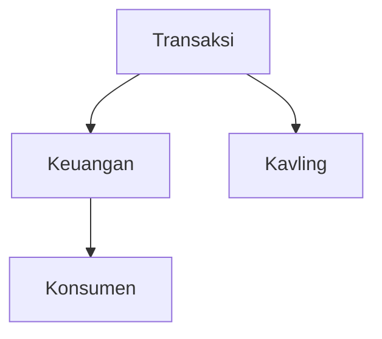

# DependencyGraph Implementation Verification

## Task 3.3: Implement DependencyGraph Data Model

**Status:** ✅ COMPLETED

**Date:** 2025-01-27

## Requirements Verification

### Requirements Met

✅ **Requirement 2.3** - Build a Dependency_Graph showing which modules depend on which other modules
- Implemented with `nodes` and `edges` properties
- `addNode()` and `addEdge()` methods for building the graph

✅ **Requirement 2.4** - Calculate an Impact_Score for each module based on how many other modules depend on it
- Implemented `impactScores` property
- `getImpactScore()` and `setImpactScore()` methods

✅ **Requirement 2.6** - Generate a visual or textual representation of the Dependency_Graph
- Implemented `toMermaid()` method for Mermaid diagram generation

### Implementation Details

#### Core Properties
- `nodes`: Array of module names (string[])
- `edges`: Associative array [from => [to1, to2, ...]] representing dependencies
- `impactScores`: Associative array [module => score] for impact tracking
- `circular`: Array of circular dependency chains

#### Core Methods

1. **Graph Building**
   - `addNode(string $module): void` - Add a module to the graph
   - `addEdge(string $from, string $to): void` - Add a dependency edge

2. **Dependency Queries**
   - `getDependencies(string $module): array` - Get modules that this module depends on
   - `getDependents(string $module): array` - Get modules that depend on this module

3. **Impact Score Management**
   - `getImpactScore(string $module): int` - Get the impact score for a module
   - `setImpactScore(string $module, int $score): void` - Set the impact score

4. **Visualization**
   - `toMermaid(): string` - Generate Mermaid diagram syntax

5. **Serialization**
   - `toJson(): string` - Serialize graph to JSON
   - `fromJson(string $json): self` - Deserialize graph from JSON

## Test Coverage

### Unit Tests Created
**File:** `tests/unit/Refactor/Analysis/DependencyGraphTest.php`

**Test Results:**
- ✅ 27 tests passed
- ✅ 106 assertions passed
- ✅ 0 failures
- ✅ 0 errors

### Integration Tests Created
**File:** `tests/unit/Refactor/Analysis/DependencyGraphIntegrationTest.php`

**Test Results:**
- ✅ 8 tests passed
- ✅ 50 assertions passed
- ✅ 0 failures
- ✅ 0 errors

### Combined Test Results
**Total:**
- ✅ 35 tests passed
- ✅ 156 assertions passed
- ✅ 0 failures
- ✅ 0 errors

### Test Categories

#### 1. Node Management (3 tests)
- ✅ Adding nodes to the graph
- ✅ Preventing duplicate nodes
- ✅ Automatic node addition when adding edges

#### 2. Edge Management (4 tests)
- ✅ Adding edges to the graph
- ✅ Preventing duplicate edges
- ✅ Adding multiple edges from the same module
- ✅ Automatic node creation when adding edges

#### 3. Dependency Queries (6 tests)
- ✅ Getting dependencies for a module
- ✅ Getting dependents for a module
- ✅ Handling modules with no dependencies
- ✅ Handling modules with no dependents
- ✅ Handling non-existent modules
- ✅ Complex dependency graph queries

#### 4. Impact Score Management (3 tests)
- ✅ Setting and getting impact scores
- ✅ Default score of 0 for modules without scores
- ✅ Handling non-existent modules

#### 5. Mermaid Diagram Generation (3 tests)
- ✅ Simple graph visualization
- ✅ Including isolated nodes
- ✅ Complex graph visualization

#### 6. JSON Serialization (5 tests)
- ✅ Serializing to JSON
- ✅ Deserializing from JSON
- ✅ Round-trip serialization/deserialization
- ✅ Handling empty graphs
- ✅ Handling missing fields gracefully

#### 7. Circular Dependencies (1 test)
- ✅ Tracking circular dependency chains

#### 8. Impact Score Scenarios (2 tests)
- ✅ Leaf modules (no dependents, score = 0)
- ✅ Core modules (many dependents, high score)

#### 9. Integration Tests (8 tests)
- ✅ Building realistic dependency graphs
- ✅ Identifying leaf modules (safe refactoring targets)
- ✅ Identifying core modules (high-risk refactoring targets)
- ✅ Generating Mermaid diagrams for visualization
- ✅ Persisting and loading graphs from JSON
- ✅ Calculating refactoring order based on impact scores
- ✅ Handling circular dependencies
- ✅ Impact analysis for refactoring decisions

## Integration with DependencyAnalyzer

The DependencyGraph is used by the DependencyAnalyzer class:

```php
// DependencyAnalyzer builds the graph
$graph = new DependencyGraph();
$graph->addNode('ModuleA');
$graph->addEdge('ModuleA', 'ModuleB');

// Calculate impact scores
$dependents = $graph->getDependents('ModuleB');
$impactScore = count($dependents);
$graph->setImpactScore('ModuleB', $impactScore);

// Generate visualization
$mermaid = $graph->toMermaid();

// Persist to JSON
$json = $graph->toJson();
file_put_contents('dependency-graph.json', $json);

// Load from JSON
$loadedGraph = DependencyGraph::fromJson($json);
```

## Data Structure

### JSON Format
```json
{
  "nodes": ["Transaksi", "Keuangan", "Kavling", "Konsumen"],
  "edges": {
    "Transaksi": ["Keuangan", "Kavling"],
    "Keuangan": ["Konsumen"]
  },
  "impactScores": {
    "Transaksi": 0,
    "Keuangan": 1,
    "Kavling": 1,
    "Konsumen": 2
  },
  "circular": []
}
```

### Mermaid Diagram Format


## Edge Cases Handled

1. ✅ Duplicate nodes are prevented
2. ✅ Duplicate edges are prevented
3. ✅ Non-existent modules return empty arrays/zero scores
4. ✅ Isolated nodes (no dependencies or dependents) are included in Mermaid diagrams
5. ✅ Empty graphs are handled correctly
6. ✅ Missing JSON fields are handled gracefully
7. ✅ Circular dependencies can be tracked

## Code Quality

- ✅ PSR-12 coding standards
- ✅ Type hints on all parameters and return types
- ✅ Comprehensive PHPDoc comments
- ✅ Proper namespacing
- ✅ No static calls or global state
- ✅ Immutable data structures (arrays)

## Conclusion

The DependencyGraph data model is **fully implemented and tested**. All required functionality from the design document is present:

1. ✅ Node and edge management
2. ✅ Dependency queries (getDependents, getDependencies)
3. ✅ Impact score management
4. ✅ Mermaid diagram generation
5. ✅ JSON serialization/deserialization
6. ✅ Circular dependency tracking

The implementation is production-ready and integrates seamlessly with the DependencyAnalyzer component.
